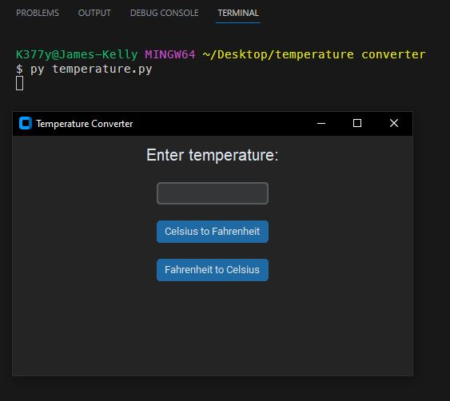
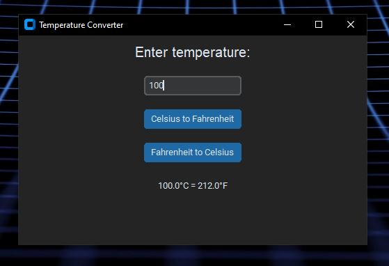
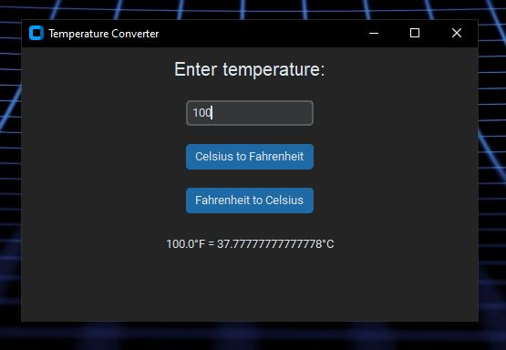

# Python Temperature Converter

 

## Description
This is my first stand alone Python application that runs outside of the terminal window and in its own GUI interface. It is very basic, but a stepping stone to greater things.
 

## *Installation & Usage*
To install this app, simply clone the repository and run the `temperature.py` file in your terminal. 
 

 

### When prompted: 
Enter a numeric temperature value. 
Select one of the buttons for the conversion desired. 

 

 
 
 

## *Questions*
<h3>Portfolio:&emsp;<a href="https://jk377y.dev" target="_blank">https://jk377y.dev</a></h3>
<h3>Email:&emsp;<a href="mailto:jk377y@gmail.com" target="_blank">jk377y@gmail.com</a></h3>
<h3>LinkedIn:&emsp;<a href="https://www.linkedin.com/in/james-kelly-software-developer/" target="_blank">https://www.linkedin.com/in/james-kelly-software-developer/</a></h3>
<h3>GitHub:&emsp;<a href="https://github.com/jk377y" target="_blank">https://github.com/jk377y</a></h3>
 

## *License*

 Copyright (c) 2023 James Kelly
 Information on this license can be found at: (https://opensource.org/licenses/MIT)